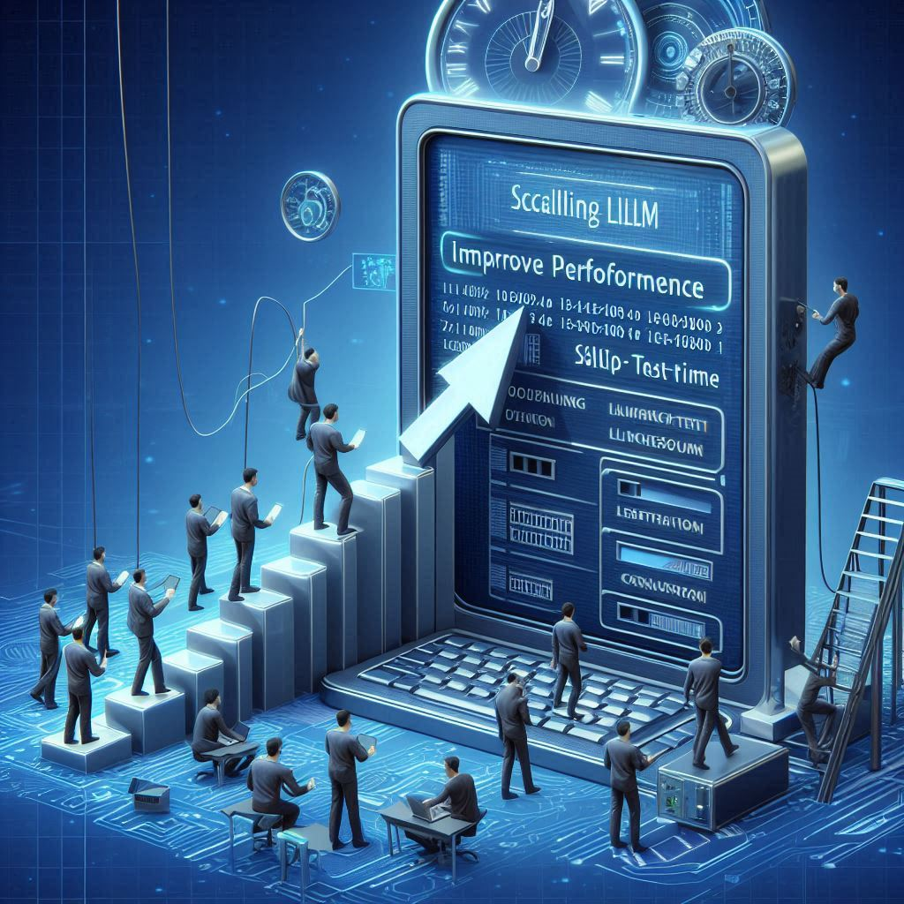

  
  
  
  

    

<h1 align="center">Awesome LLM Test-Time Scaling</h1>

    <b> Curated collection of papers and resources on enhancing LLM performance through increased test-time computation.</b>

  
🗂️ Table of Contents

  <ol>
    <li><a href="#survey">Survey</a></li>
    <li><a href="#analysis">Analysis</a></li>
    <li><a href="#technique">Technique</a></li>
    <li><a href="#other-useful-resources">Other Useful Resources</a></li>
    <li><a href="#other-awesome-lists">Other Awesome Lists</a></li>
    <li><a href="#contributing">Contributing</a></li>
  </ol>

## Survey

## Analysis

## Technique

## Other Useful Resources

## Other Awesome Lists

- **[Awesome-LLM-Reasoning](https://github.com/atfortes/Awesome-LLM-Reasoning)**  Collection of papers and resources on LLM Reasoning.
- **[Awesome-LLM-Synthetic-Data](https://github.com/wasiahmad/Awesome-LLM-Synthetic-Data)**  Collection of papers and resources on LLM based Synthetic Data Generation.
- **[Awesome-Controllable-Generation](https://github.com/atfortes/Awesome-Controllable-Generation)**  Collection of papers and resources on Controllable Generation using Diffusion Models.
- **[Chain-of-ThoughtsPapers](https://github.com/Timothyxxx/Chain-of-ThoughtsPapers)**  A trend starts from "Chain-of-Thought Prompting Elicits Reasoning in Large Language Models".
- **[LM-reasoning](https://github.com/jeffhj/LM-reasoning)**  Collection of papers and resources on Reasoning in Large Language Models.
- **[Prompt4ReasoningPapers](https://github.com/zjunlp/Prompt4ReasoningPapers)**  Repository for the paper "Reasoning with Language Model Prompting: A Survey".
- **[ReasoningNLP](https://github.com/FreedomIntelligence/ReasoningNLP)**  Paper list on reasoning in NLP
- **[Awesome-LLM](https://github.com/Hannibal046/Awesome-LLM)**  Curated list of Large Language Model.
- **[Awesome-LLM-Self-Consistency](https://github.com/SuperBruceJia/Awesome-LLM-Self-Consistency)**  Curated list of Self-consistency in Large Language Models.
- **[Deep-Reasoning-Papers](https://github.com/floodsung/Deep-Reasoning-Papers)**  Recent Papers including Neural-Symbolic Reasoning, Logical Reasoning, and Visual Reasoning.

    <a href="#readme-top" style="text-decoration: none; color: #007bff; font-weight: bold;">
        ↑ Back to Top ↑
    </a>

## Contributing

- Add a new paper or update an existing paper, thinking about which category the work should belong to.
- Use the same format as existing entries to describe the work.
- Add the abstract link of the paper (`/abs/` format if it is an arXiv publication).

**Don't worry if you do something wrong, it will be fixed for you!**

### Contributors

### Star History

